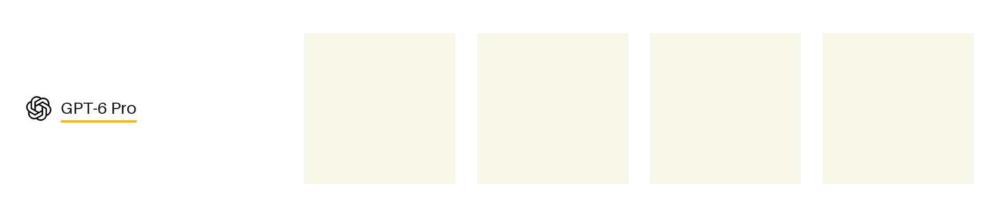

# autoregressive-drawing

Models draw 32×32 pixel art one `#RRGGBB` token at a time, in reading order, with no edits.




GPT-6 Pro drew the four subjects directly in ChatGPT, one independent agent per
subject. Each grid was written once, without revisions; code only validated and
rendered the emitted pixels. API token counts and reasoning-effort metadata are
not available for these samples.

- `PROMPTS.md` — the rules and the four subject prompts
- `drawings/<model>/` — the grids each model emitted, with raw replies, reasoning traces and run metadata where available
- `render.py` — upscales a grid to PNG
- `run_models.py` — runs the prompts against models on OpenRouter
- `make_gif.py` — animates every grid being drawn

```
python3 render.py drawings/fable/lighthouse.txt
python3 run_models.py            # needs OPENROUTER_API_KEY
python3 make_gif.py
python3 make_gif.py out/qwen-gptoss.gif --rows qwen3.8-27b gpt-oss-120b
python3 make_gif.py out/gpt-6-pro.gif --rows gpt-6-pro
```
